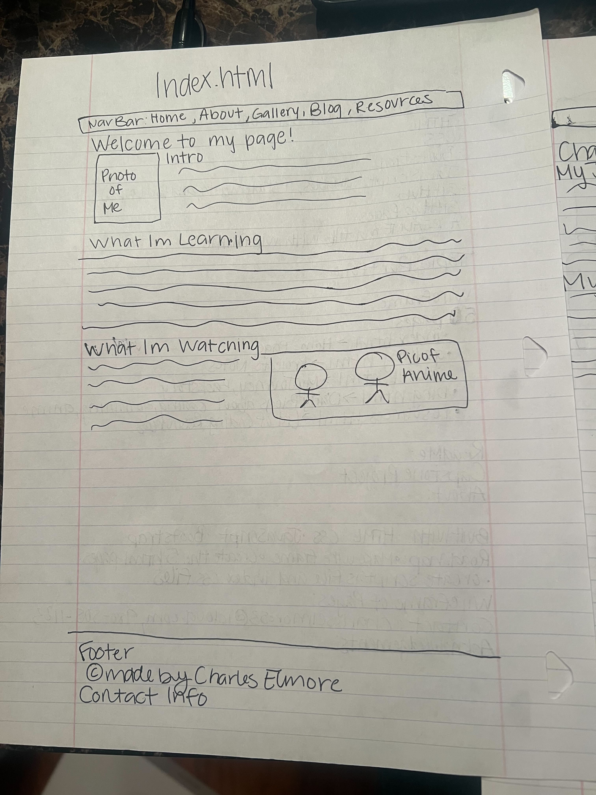
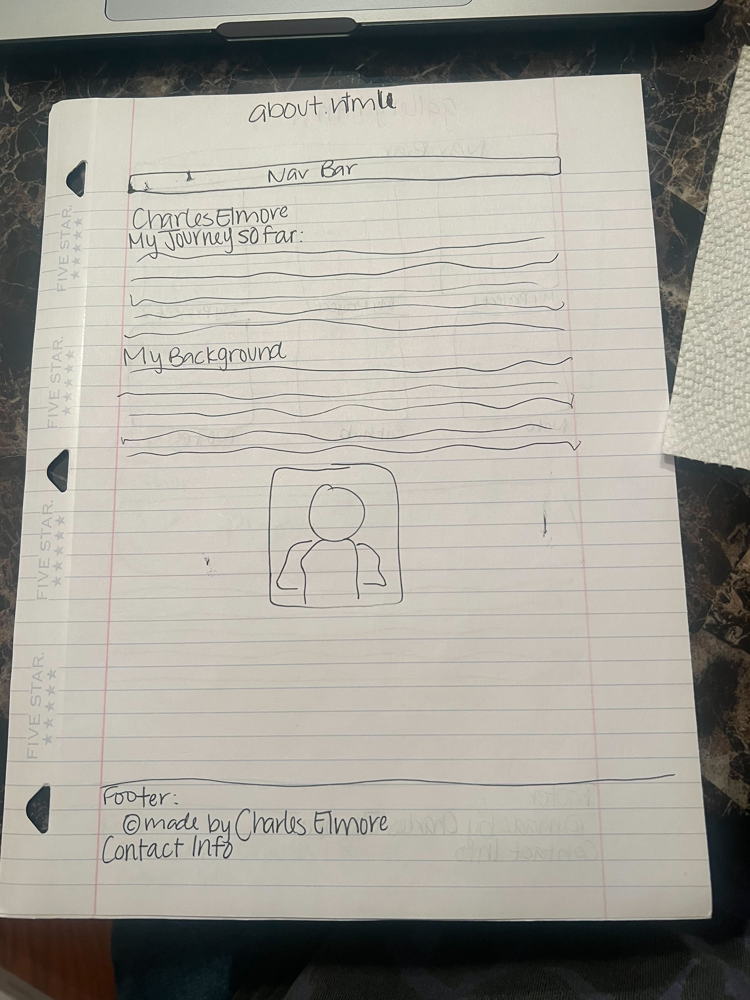
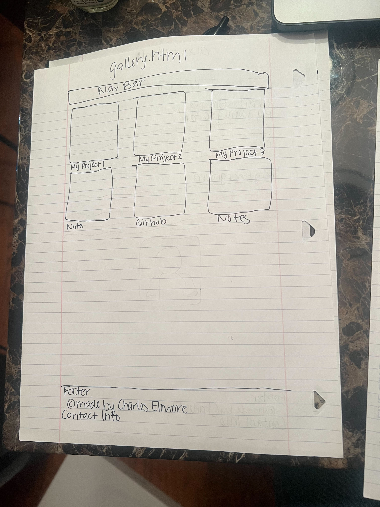
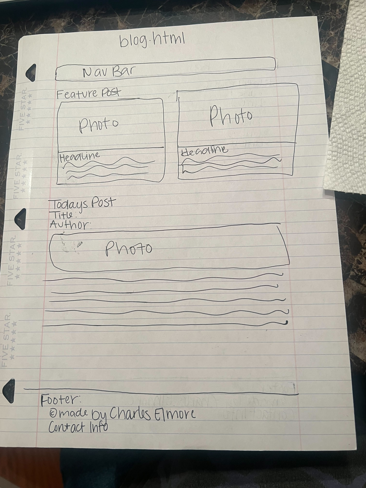
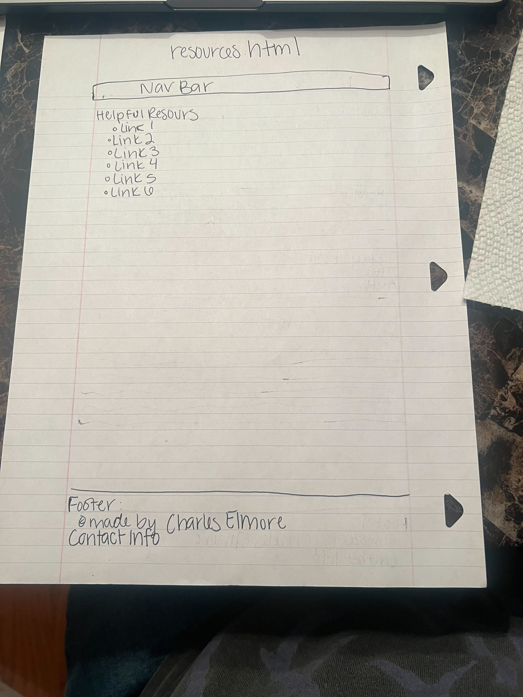

# Capstone-Level-1

## About

For my level one capstone project I decided to create a personal portfolio that contains information on my coding journey along with some updates on my new skills and what I'm working on.

## Built with

*HTML
*CSS
*JavaScript
*Bootstrap 5

## Roadmap

- [x] Create GitHub Repostitory
- [x] Create index.html, about.html, gallery.html, blog.html, and resources.html.
- [x] Create CSS files and .JS files to accompany html pages.
- [x] Upload wireframe photos to README.md.

## Wireframe

## Contact

Charles Elmore - <charleselmore53@icloud.com>

## Acknowledgements

* [Cloudinary Readme Inages](https://cloudinary.com/guides/web-performance/4-ways-to-add-images-to-github-readme-1-bonus-method)
* [W3 Schools](https://www.w3schools.com/)
* [Bootstrap Documentation](https://getbootstrap.com/docs/5.3/getting-started/introduction/)
* [StackOverflow](https://stackoverflow.com/)
* [Pexels](https://www.pexels.com/)
* [MDN Web Docs](https://developer.mozilla.org/en-US/)